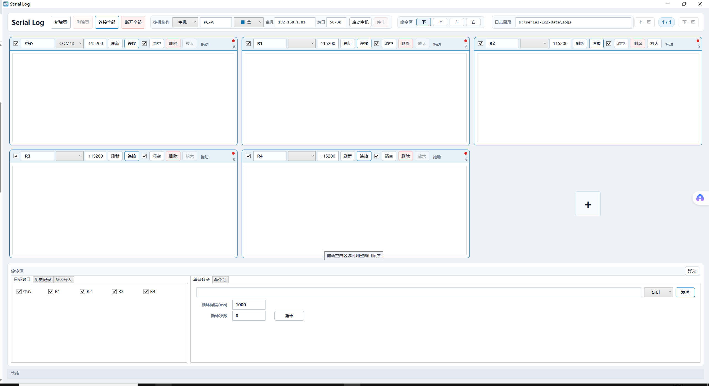

# Serial Log

Serial Log 是一个 Windows 串口日志桌面工具，基于 .NET 8 WPF。它面向多串口调试场景，重点解决多窗口日志观察、命令发送、AT 命令导入和多电脑协作验证。




## 重点功能

- 多串口日志窗口：一页最多 3 x 2 显示，超出后自动分页。
- 多机协作：一台电脑可作为主机汇总查看其他电脑上报的串口窗口和日志状态，并可向远端窗口发送命令。
- 串口窗口管理：支持重命名、分页、拖动排序、窗口扩展、连接/断开、刷新端口、自动保存和清空日志。
- 命令区：支持单条命令、命令组、循环发送、目标窗口选择、历史命令回填。
- AT 命令导入：支持普通 AT 列表、字面量 `\r\n` 列表、`.c/.h` 中的 `AT_CMD_EXPORT(...)`，以及手动输入自定义命令。
- 日志保存：按连接会话保存日志，默认目录为 `D:\serial-log-data\logs`。
- 版本与协议可见：界面标题区显示应用版本和多机协作协议版本，便于多电脑排查版本不一致问题。
- 心跳与重连：客户端会定时向主机发送心跳，断线后进入等待重连状态并自动重试。
- 便携发布：Release 包为 win-x64 自包含版本，解压后直接运行 `SerialLog.App.exe`；流水线同时生成 MSIX 预备安装包。

## 多机协作模型

当前多机协作是“主机汇总”的模型，不是所有电脑完全镜像同一工作区：

- 每台电脑只管理自己的本地串口窗口。
- 客户端会把本机窗口快照和日志行上报给主机。
- 主机界面会显示本机窗口 + 客户端远端窗口，并用颜色区分来源电脑。
- 主机可以向客户端的远端窗口下发命令。

## 使用方式

1. 下载 GitHub Release 中的 `SerialLog-*-win-x64-portable.zip`。
2. 解压到任意目录，例如 `D:\tools\SerialLog`。
3. 双击 `SerialLog.App.exe` 启动。
4. 如需多机协作，确保两台电脑在同一局域网，且 Windows 防火墙允许程序通信。

多机协作快速验证：

1. 主机电脑：顶部“多机协作”选择“主机”，确认 IP 和端口，点击“启动主机”。
2. 客户端电脑：顶部“多机协作”选择“客户端”，填写主机 IP 和同一端口，点击“连接主机”。
3. 连接后主机端应能看到客户端窗口来源颜色和远端串口状态。

## 项目结构

```text
src/SerialLog.App       WPF 桌面应用
src/SerialLog.Core      串口、日志、命令、配置与多机协作核心逻辑
tests/SerialLog.Tests   单元测试
docs/                   使用说明与界面截图
```

## 开发环境

- Windows
- .NET 8 SDK

本机推荐使用 D 盘 .NET SDK：

```powershell
$env:DOTNET_ROOT='D:\Program Files\dotnet'
$env:PATH='D:\Program Files\dotnet;' + $env:PATH
```

## 构建与测试

```powershell
dotnet restore SerialLog.sln
dotnet build SerialLog.sln -c Debug --no-restore
dotnet test SerialLog.sln --no-restore
dotnet publish src\SerialLog.App\SerialLog.App.csproj -c Release -r win-x64 --self-contained true -o D:\serial-log-data\publish-latest
```

发布预览版前建议先关闭正在运行的 `SerialLog.App.exe`，并清空旧发布目录，避免旧 DLL 残留。串口功能依赖 Windows 版 `System.IO.Ports.dll`，发布目录根部的该文件大小应约为 `87728` 字节。

## 发布

仓库内置 GitHub Actions 发布流水线：

- 推送 `v*` tag 时自动运行测试、发布 win-x64 自包含版本、生成 ZIP 与 SHA256，并创建 GitHub Release。
- 也可以在 Actions 页面手动触发 `Release` 工作流生成构建产物。
- 流水线会尝试生成 MSIX 包；如果配置了 `WINDOWS_SIGNING_CERT_BASE64` 和 `WINDOWS_SIGNING_CERT_PASSWORD` 两个仓库 secrets，会自动签名 MSIX。

没有正式代码签名证书时，Windows 仍可能出现安全提示。要减少 SmartScreen 提示，需要使用可信 CA 签发的代码签名证书，并在 GitHub secrets 中配置 PFX 证书内容和密码。

## 文档

- [使用说明](docs/使用说明.md)
