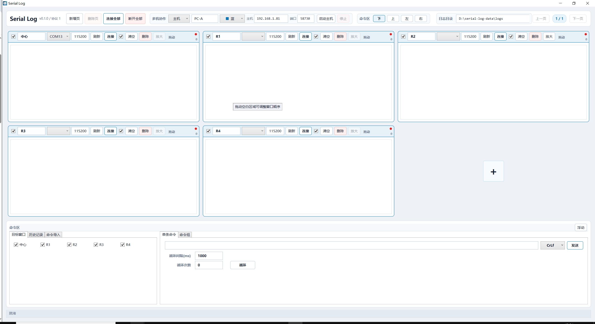
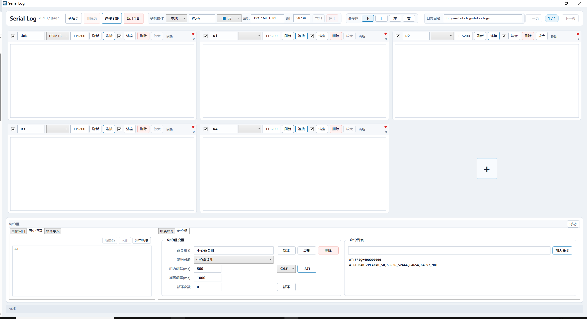

# Serial Log

Serial Log 是一个面向多设备联调的 Windows 串口日志与命令协作工具。它不是单窗口串口助手，而是为中心节点、多节点、网关、Mesh、TDMA 等需要同时观察多个串口的调试场景设计的工作台。





> 想快速了解工作方式？[打开动态产品介绍页](docs/website/index.html)，可直接在浏览器预览。
## 适合场景

- 一台电脑同时连接多个串口设备，需要集中观察日志。
- 中心节点、R1、R2、R3 等多个角色需要一起调试。
- 需要向多个目标发送相同 AT 命令，或按命令组循环执行。
- 多台电脑分别连接不同设备，但希望主机端统一查看状态并远程下发命令。
- 调试过程需要自动保存日志，便于复盘和对比。

## 重点功能

- 多串口窗口：一页最多显示 3 x 2 个串口窗口，超出后自动分页。
- 窗口布局：支持拖动排序、跨页移动、纵向放大、页面新增和删除。
- 串口管理：支持端口自动刷新、常用波特率下拉、自定义波特率、连接后直接修改波特率。
- 日志保存：按连接会话自动保存，默认目录为 `D:\serial-log-data\logs`。
- 命令发送：支持单条命令、目标窗口选择、历史记录、循环发送。
- 命令组：支持多条命令顺序执行、组内间隔、循环执行、独立目标选择。
- AT 命令导入：支持普通 AT 列表、字面量 `\r\n`、`.c/.h` 中的 `AT_CMD_EXPORT(...)`。
- 命令区布局：可停靠在下、上、左、右，也可浮动为独立窗口。
- 多机协作：主机汇总客户端窗口和日志状态，并可向客户端串口窗口下发命令。
- 版本识别：标题区显示应用版本和协作协议版本，便于多电脑排查版本不一致。

## 下载与启动

推荐使用便携版 ZIP：

1. 打开 GitHub Release。
2. 下载 `SerialLog-v0.1.0-win-x64-portable.zip`。
3. 解压到任意目录，例如 `D:\tools\SerialLog`。
4. 双击 `SerialLog.App.exe` 启动。

便携版不需要安装证书，不写入系统安装目录，更适合内网调试电脑之间快速复制验证。

如果下载 MSIX 包，Windows 会要求验证签名证书。当前发布包主要推荐使用 ZIP；MSIX 只作为安装包预备产物保留。

## 快速上手

1. 在每个串口窗口选择端口和波特率。
2. 点击单个窗口的 `连接`，或点击顶部 `连接全部`。
3. 在命令区选择目标窗口，输入命令并点击 `发送`。
4. 需要批量命令时切换到 `命令组`，加入命令后点击 `执行` 或 `循环`。
5. 需要保存日志时保持窗口标题栏的自动保存复选框勾选。

日志默认写入：

```text
D:\serial-log-data\logs
```

每次连接会创建新的会话目录；`连接全部` 会让本次批量连接的窗口共用一个会话目录。

## 多机协作

多机协作采用“主机汇总”模型：

- 每台电脑只管理自己的本地串口。
- 客户端把本机窗口快照和日志行上报给主机。
- 主机显示本机窗口和远端窗口，并用电脑颜色区分来源。
- 主机可以向客户端远端窗口下发命令。
- 客户端断线后会自动等待重连。

验证步骤：

1. 主机电脑顶部 `多机协作` 选择 `主机`。
2. 确认主机 IP 和端口，点击 `启动主机`。
3. 客户端电脑顶部 `多机协作` 选择 `客户端`。
4. 填写主机 IP 和同一端口，点击 `连接主机`。
5. 主机端看到客户端远端窗口后，即可勾选目标并发送命令。

注意：

- 多台电脑需要在同一局域网内互通。
- Windows 防火墙需要允许主机端监听端口。
- 多机协作异常时，先确认标题区显示的协议版本一致。

## AT 命令导入

命令导入支持三类常用来源。

普通文本：

```text
AT
AT+GMR
AT+RESET
```

字面量 `\r\n`：

```text
AT\r\nAT+GMR\r\nAT+RESET\r\n
```

C 代码宏：

```c
AT_CMD_EXPORT("AT+ROLE", "=<role[0-2]>", mesh_at_role_test, mesh_at_role_query, mesh_at_role_setup, NULL);
AT_CMD_EXPORT("AT+NB", NULL, NULL, mesh_at_neighbor_query, NULL, NULL);
```

导入结果：

```text
AT+ROLE=<role[0-2]>
AT+NB
```

## 工作区配置

默认工作区文件：

```text
D:\serial-log-data\workspace.json
```

保存内容包括窗口标题、端口、波特率、分页、日志目录、命令历史、AT 命令集、命令组、多机协作配置和命令区布局。

## 开发与构建

开发环境：

- Windows
- .NET 8 SDK

本机推荐使用 D 盘 .NET SDK：

```powershell
$env:DOTNET_ROOT='D:\Program Files\dotnet'
$env:PATH='D:\Program Files\dotnet;' + $env:PATH
```

常用命令：

```powershell
dotnet restore SerialLog.sln
dotnet build SerialLog.sln -c Debug --no-restore
dotnet test SerialLog.sln --no-restore
dotnet publish src\SerialLog.App\SerialLog.App.csproj -c Release -r win-x64 --self-contained true -o D:\serial-log-data\publish-latest
```

## 项目结构

```text
src/SerialLog.App       WPF 桌面应用
src/SerialLog.Core      串口、日志、命令、配置和多机协作核心逻辑
tests/SerialLog.Tests   单元测试
docs/                   使用说明和界面截图
packaging/              MSIX 打包清单
scripts/                发布辅助脚本
```

更完整的功能说明见 [docs/使用说明.md](docs/使用说明.md)。
