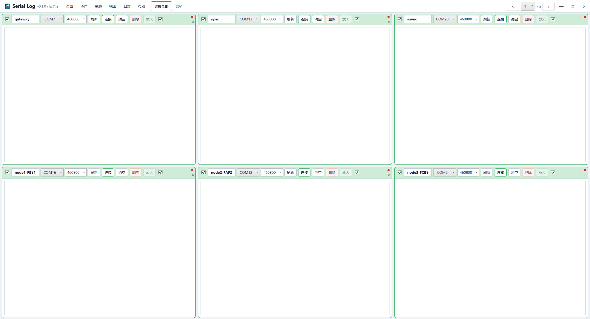
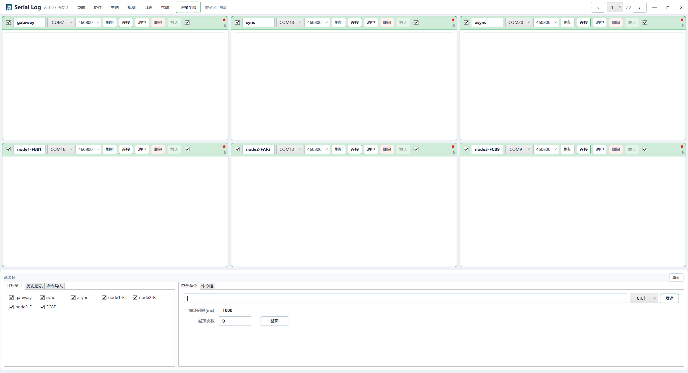

# Serial Log

Serial Log 是面向嵌入式开发与多设备联调的 Windows 多串口日志工作台。它把多窗口日志、命令编排、日志留存、页面管理和局域网多机协作集中在同一个界面中。





> [打开动态产品介绍页](https://wangjingping-88.github.io/serial-log/website/) · [查看在线操作说明](https://wangjingping-88.github.io/serial-log/help/) · [下载最新版本](https://github.com/wangjingping-88/serial-log/releases/latest)

## 适用场景

- 一台电脑同时观察网关、中心节点、终端等多个串口设备。
- 多台电脑分别连接设备，但需要共享窗口状态与实时日志。
- 向多个目标发送 AT 命令，或按命令组循环执行测试流程。
- 长时间采集日志，并按会话、设备和文件分段进行复盘。
- 通过 CLI 接入 AI 或自动化脚本，扩展 TDMA、EcoLink 等专项测试。

## 重点功能

### 多串口工作台

- 每页最多排列 `3 x 2` 个串口窗口，支持多页、循环翻页和直接跳转。
- 标题栏右侧提供上一页、页码跳转和下一页控件，翻页无需展开菜单。
- 支持拖动排序、跨页移动、窗口放大和布局状态恢复。
- 端口列表可刷新，波特率提供常用选项并支持自定义输入。
- 单个窗口与全部窗口均可连接、断开、清空日志和控制自动跟随。

### 紧凑标题栏

- 页面、协作、主题、视图、日志、快捷键和帮助集中到标题栏菜单。
- 打开任一标题栏菜单后，可横向悬停切换到其他菜单。
- 标题栏显示应用版本、协作协议版本和最近操作状态。
- 主题色同步应用到菜单高亮、串口窗口边框和滚动条。
- 支持 Windows 调色板自定义主题色。

### 日志查看与保存

- 解析 ANSI 颜色标识，界面按日志级别着色显示。
- 界面时间戳仅显示时分秒和毫秒，文件中保存完整日期时间。
- 每个窗口界面最多保留 5000 行，避免长期运行拖慢界面；磁盘日志不受此限制。
- 单个日志文件默认达到 100 MB 后自动创建 `_001`、`_002` 等分段文件；可在日志菜单中设置为 50～10240 MB。
- 鼠标滚轮向上查看历史时暂停自动跟随，滚动回最底部或按 `Enter` 后恢复跟随。
- 支持选择、右键复制、`Ctrl+A` 全选和 `Ctrl+C` 复制。
- 本地及远端日志均可按会话自动保存。
- 同一会话内取消后重新勾选自动保存，会从下一个编号文件继续保存；取消期间的日志不补写。
- “无数据自动重连”默认关闭，避免低频日志设备被误判断线；需要时可在日志菜单设置静默秒数。
- 日志菜单可直接打开当前会话目录；窗口缩小时日志字号保持不变，其他界面按比例缩放且设有最小缩放限制。

### 命令区

- 支持单条命令、历史记录、循环发送、AT 命令导入和命令组。
- 命令组支持独立目标、组内间隔、循环间隔和循环次数。
- 命令区可停靠在上、下、左、右，可浮动，也可隐藏为纯日志模式。
- 从机上的远端窗口保持只读，不会进入可发送目标。

### 多机协作（协议 2）

- 采用主机中继架构，不建立从机之间的直连。
- 主机可查看并控制从机窗口。
- 从机可查看主机和其他从机的窗口状态与实时日志。
- 每台电脑不会显示自己的镜像窗口。
- 远端日志默认保存到当前电脑；成员断线后标记离线，重连时原位恢复。
- 协作电脑必须使用相同的协议版本，新旧版本不会静默混用。

### 页面、主题与快捷键

- 页面支持新增、删除空白页、上一页、下一页、循环切换和直接跳转。
- “快捷键”菜单集中展示全部可配置操作及当前组合键，点击菜单项可直接执行。
- 快捷键可修改、清除、恢复默认，并在保存前检测冲突。
- 标题栏菜单和文本输入打开时不会误触普通全局快捷键。

### 在线版本检查

- 启动后静默检查 GitHub 最新正式 Release；检查失败不会打断串口和日志工作。
- 可随时通过“帮助 → 检查更新”手动检查，并查看明确的检查结果。
- 便携版支持下载进度、SHA-256 校验、自动替换、失败回滚和重启恢复。
- MSIX 版本仅提示新版本并打开 Release 页面，不在应用内覆盖安装。
- 发现新版本后始终由用户决定是否安装，不执行静默更新。

## 下载与启动

推荐使用 Release 中的便携版 ZIP：

1. 打开 [GitHub Releases](https://github.com/wangjingping-88/serial-log/releases)。
2. 下载最新的 `SerialLog-v<版本号>-win-x64-portable.zip`。
3. 解压到任意目录，例如 `D:\tools\SerialLog`。
4. 双击 `SerialLog.App.exe`。

便携版无需安装证书。MSIX 需要先信任随包提供的签名证书，普通调试电脑建议优先使用 ZIP。

首次安装包含在线更新模块的版本仍需手动下载。此后便携版可通过“帮助 → 检查更新”完成升级；协作电脑建议使用相同版本。更新暂存文件保存在系统临时目录，并在目录切换时保留工具目录中的用户数据：

```text
%TEMP%\SerialLog\updates
```

## 快速开始

1. 在串口窗口中选择端口与波特率。
2. 点击窗口内的“连接”，或使用标题栏“连接全部”。
3. 在“日志”菜单选择保存目录，按需新建日志会话。
4. 需要发送命令时，在“视图”菜单显示并停靠命令区。
5. 需要多机共享时，在“协作”菜单设置主机或从机模式。

日志默认保存到：

```text
D:\serial-log-data\logs
```

同一日志会话只创建一个会话目录；点击“新建会话”后，已连接窗口的后续日志也会切换到新目录。

## 常用快捷键

| 功能 | 默认快捷键 |
|---|---|
| 打开操作说明 | `F1` |
| 新增页面 | `Ctrl+N` |
| 删除当前页 | `Alt+Delete` |
| 上一页 / 下一页 | `Left` / `Right` |
| 新增串口窗口 | `Alt+P` |
| 连接 / 断开当前窗口 | `Ctrl+L` |
| 连接 / 断开全部 | `Alt+L` |
| 暂停 / 恢复当前窗口日志跟随 | `Ctrl+S` |
| 暂停 / 恢复全部窗口日志跟随 | `Alt+S` |
| 清空当前窗口日志 | `Ctrl+K` |
| 清空全部窗口日志 | `Alt+K` |
| 显示 / 隐藏命令区 | `Ctrl+M` |
| 新建日志会话 | `Alt+N` |
| 浏览日志目录 | `Alt+O` |
| 启动 / 停止多机协作 | `Alt+I` |

日志区固定使用 `Ctrl+A`、`Ctrl+C` 和 `Enter`；命令列表固定使用 `Delete`。

## 多机协作快速验证

1. 主机电脑在“协作”中选择“主机”，填写名称、地址与端口，然后启动主机。
2. 其他电脑选择“从机”，填写相同主机地址与端口，然后连接主机。
3. 新加入的从机会立即收到主机和现有从机的窗口快照。
4. 主机可向从机远端窗口发送命令；从机侧远端窗口只读。
5. 确保局域网互通，且 Windows 防火墙允许主机监听端口。

## AT 命令导入

支持普通文本、字面量 `\r\n` 和 C 代码中的 `AT_CMD_EXPORT(...)`：

```text
AT
AT+GMR
AT+RESET
```

```c
AT_CMD_EXPORT("AT+ROLE", "=<role[0-2]>", mesh_at_role_test, mesh_at_role_query, mesh_at_role_setup, NULL);
```

## CLI 自动化辅助

`src/SerialLog.Cli` 可作为 AI 或自动化脚本的扩展入口，目前提供：

```text
SerialLog.Cli tdma-analyze --log-dir <dir> --center <addr> --target <addr>
SerialLog.Cli tdma-loop --config <tdma-loop.json>
SerialLog.Cli ecolink-loop --config <ecolink-loop.json>
SerialLog.Cli ecolink-ota --config <ecolink-ota.json>
```

仓库仅提供通用实现与示例配置，本地测试脚本、设备地址和私有环境参数不纳入版本库。

## 工作区配置

工作区、串口日志和崩溃日志默认保存在工具自身目录：

```text
<工具目录>\data\workspace.json
<工具目录>\data\logs\
<工具目录>\data\crash-logs\
```

工作区保存窗口、页面、端口、波特率、主题、日志目录、命令区布局、协作设置、发送历史、命令集、命令组和快捷键配置。首次运行新版时会兼容迁移旧的 `D:\serial-log-data\workspace.json`；没有 D 盘也可正常启动和连接。

## 开发与构建

环境要求：Windows、.NET 8 SDK。

```powershell
dotnet restore SerialLog.sln
dotnet build SerialLog.sln -c Debug --no-restore
dotnet test SerialLog.sln --no-restore
dotnet publish src\SerialLog.App\SerialLog.App.csproj -c Release -r win-x64 --self-contained true -o D:\serial-log-data\publish-latest
```

项目结构：

```text
src/SerialLog.App       WPF 桌面应用
src/SerialLog.Core      串口、日志、命令、配置和协作核心逻辑
src/SerialLog.Cli       TDMA / EcoLink 自动化辅助命令行
src/SerialLog.Update    更新协议、下载校验、目录切换和回滚逻辑
src/SerialLog.Updater   便携版独立更新助手
tests/SerialLog.Tests   单元测试与协作网络测试
docs/                   在线帮助、动态介绍页、使用说明和截图
packaging/              MSIX 打包配置
scripts/                发布辅助脚本
```

详细操作见 [在线帮助](https://wangjingping-88.github.io/serial-log/help/)；仓库内说明见 [docs/使用说明.md](docs/使用说明.md)。
